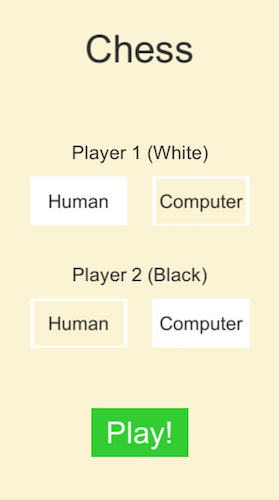
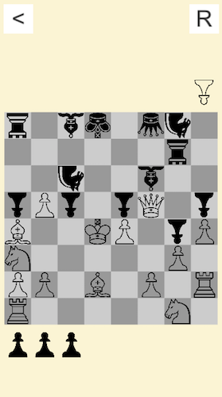

# Chess

A basic implementation of Chess created over a weekend. May be useful for those looking for a starting point in creating a chess-style game within Unity. It is released under an MIT license.

## Screenshots

<table style="width:100%">
  <tr>
    <th></th>
    <th></th> 
  </tr>
</table>

## What Works

* Pieces move correctly.
* Visual feedback of available moves for a selected piece.
* Visual feedback when there are no moves available for a selected piece.
* Opponents pieces can be captured.
* Pawns can be promoted (presently automatically to a Queen).
* Player can play against the computer or in two-player mode.
* Basic AI which makes unitelligent random moves.
* As in Shogi, Black's pieces are facing White's, unlike Chess's standard orientation of same direction. This is a design choice.

## What Doesn't Work

* Advanced piece movement such as *Castling* and *En passant* are not supported.
* There is no end game scenario.
* An algorithm to test for Checkmate needs to be written.
  * Moves should be impossible that enter the King into check, or do not resolve the current check.
* Potential moves should be ranked in terms of usefulness.
* A basic computer AI should be developed which chooses intelligent moves.

## Play Online

Although the game is optimized for mobile (Android and iOS), it can be played in the browser [here](https://defuncart.itch.io/weekend-game-jam-chess).

## Future

There are no plans to continue working on this chess implementation.

## Credits

A full list of credits can be found in [Credits.txt](Credits.txt).

## Further Reading

A number of principles utilized in this project are explained in more detail in various [#50-Unity-Tips](https://github.com/defuncart/50-unity-tips) articles:

* Binary Serialization
* iOS Launch Screen